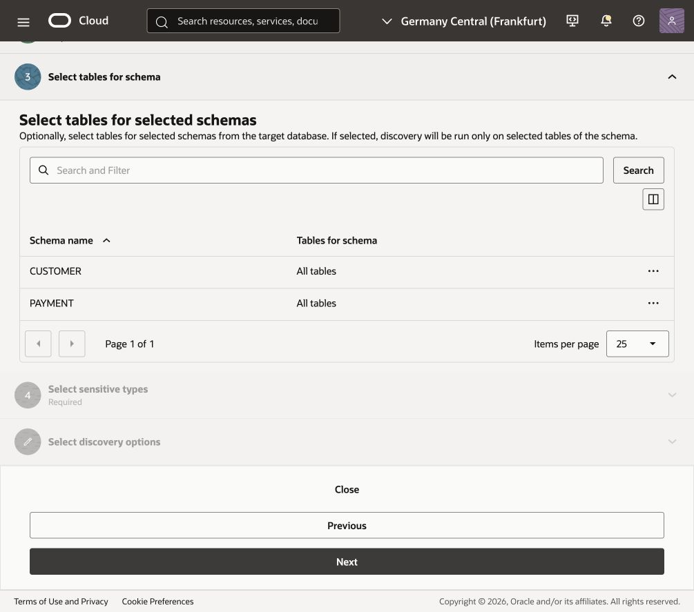
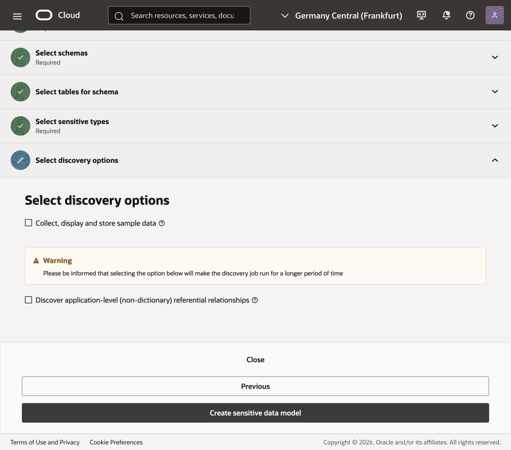
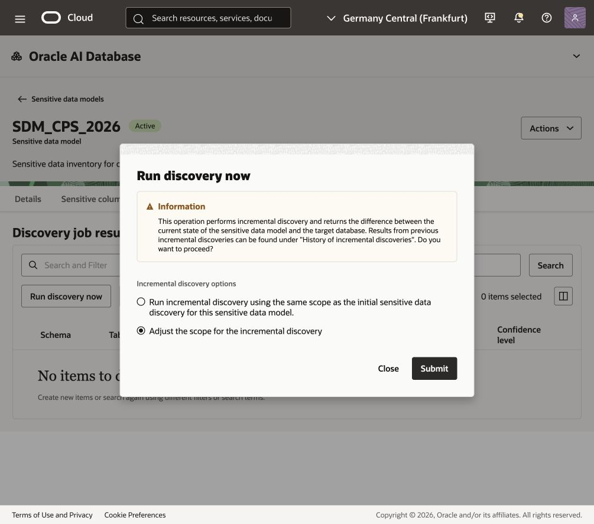
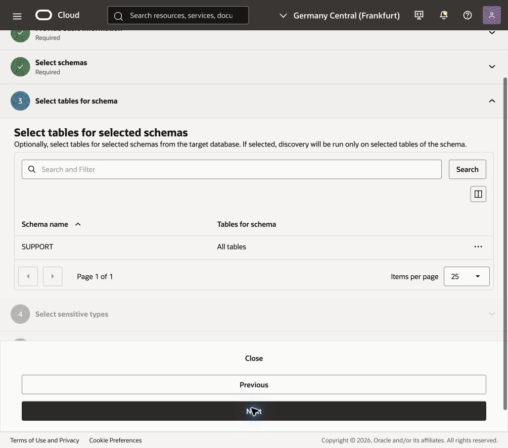
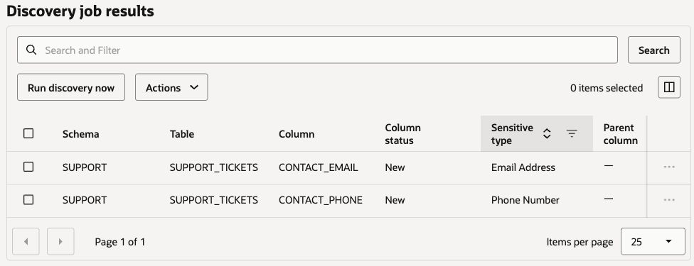
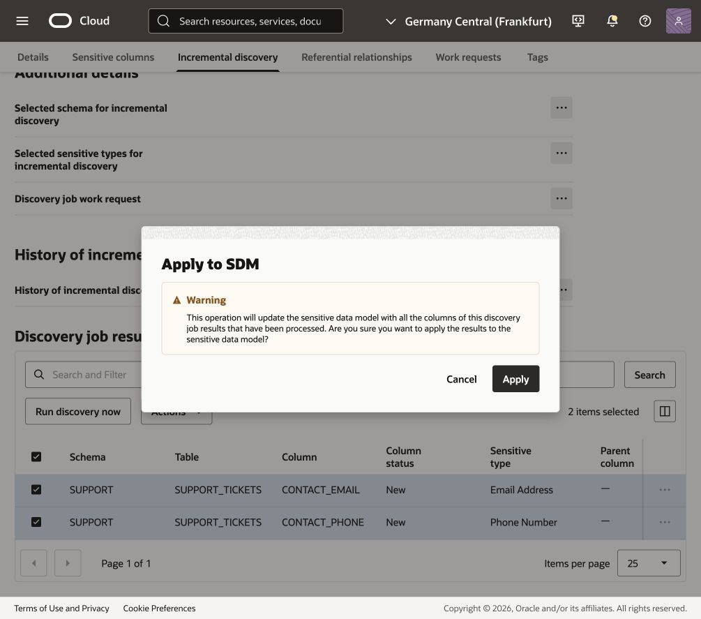
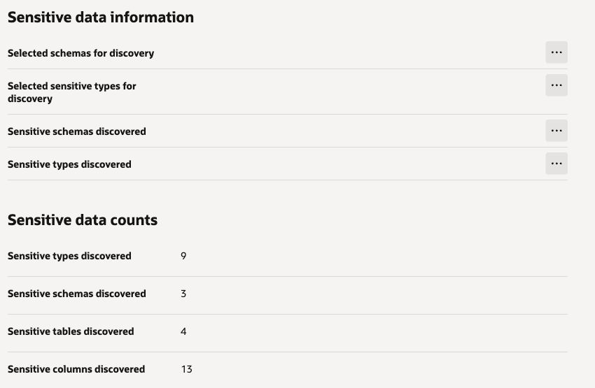

# Discover sensitive data

## Introduction

In the previous two labs, you investigated the security posture of the database and reviewed who can access it and what they can do. The next question is: What data are we trying to protect? Knowing where sensitive data resides helps you understand the impact of a compromised account and plan how to protect data used for application testing.

Oracle Data Safe Data Discovery builds an inventory of sensitive data by inspecting your target database and its data dictionary. You choose the schemas and sensitive types to search, and Data Safe records the discovered columns in a sensitive data model. Incremental discovery lets you update that model as your application's data scope changes.

### Scenario

Your team is preparing a test copy of a retail customer application to validate customer profiles, orders, and payments; first identify sensitive data in the `CUSTOMER` and `PAYMENT` schemas before masking the test copy.
When customer-support ticket testing is added to the release, use incremental discovery to include the `SUPPORT` schema in the same sensitive data model.

Estimated Lab Time: 20 minutes

### Objectives

In this lab, you will:

- Discover sensitive data in the `CUSTOMER` and `PAYMENT` schemas using common sensitive types.
- Review the sensitive data model and the initial discovery results.
- Run incremental discovery for the `SUPPORT` schema.
- Review, approve, and apply the new sensitive columns to the existing model.

### Prerequisites

This lab assumes you have:

- An Oracle Cloud account and access to the Oracle Cloud Infrastructure Console.
- Access to the workshop environment and a registered target database containing the `CUSTOMER`, `PAYMENT`, and `SUPPORT` schemas.
- Permissions to run Data Discovery and update sensitive data models in your compartment.

### Assumptions

- The `SUPPORT` schema already exists in the workshop database. Adding it to the discovery scope simulates expanding application testing to include customer support; you do not need to create a schema.
- Compartment names, target database names, dates, and discovery results can differ in your tenancy. Counts below describe the captured run, rather than a required result for every database.
- This lab reviews column metadata and leaves sample data collection disabled.

## Task 1: Discover sensitive data in customer and payment schemas

1. Navigate to **Data discovery** in Oracle Data Safe and select **Discover sensitive data**.

2. In **Provide basic information**, enter the following, and then select **Next**:

   - **Name:** `SDM1` (or a unique name in your compartment).
   - **Compartment:** your workshop compartment.
   - **Description:** `Sensitive data inventory for customer application testing`.
   - **Select database compartment** and **Select database:** the compartment and registered target database for this workshop. The screenshots use `ADB_2`.

3. In **Select schemas**, wait for the schema list to load. If the database schemas have changed since the displayed update time, select **Refresh database schemas**. Keep **Select specific schemas only** selected, and select only `CUSTOMER` and `PAYMENT`. Leave `SUPPORT` unselected for this first discovery, and select **Next**.

4. In **Select tables for schema**, confirm that `CUSTOMER` and `PAYMENT` are listed with **All tables**, and select **Next**.

   

5. In **Select sensitive types**, choose **Common sensitive types** in **Select sensitive type group**. Use the checkbox in the table header to select all common sensitive types, and select **Next**.

6. In **Select discovery options**, leave **Collect, display and store sample data** and **Discover application-level (non-dictionary) referential relationships** unselected for this lab.

   

7. Select **Create sensitive data model**. Wait until the `SDM1` model becomes **Active**.

## Task 2: Review the initial discovery results

1. On the **Details** tab, review **Sensitive data information** and **Sensitive data counts**. Use the three-dot menu beside an information item to view its details.

   In the captured run, the initial discovery found **11 sensitive columns across 2 schemas and 3 tables**, covering **9 sensitive types**.

   

2. Select **Sensitive columns**. Review the schema, table, column, sensitive type, and confidence level for the discovered columns. The **Parent column** field identifies a related sensitive column when a referential relationship is found. Sample data is empty because it was not collected.

   The initial inventory in the captured run is:

   | Schema | Table | Column | Sensitive type |
   | --- | --- | --- | --- |
   | CUSTOMER | CUSTOMERS | CUSTOMER_ADDRESS | Full Address |
   | CUSTOMER | CUSTOMERS | DATE_OF_BIRTH | Date of Birth |
   | CUSTOMER | CUSTOMERS | EMAIL_ADDRESS | Email Address |
   | CUSTOMER | CUSTOMERS | FIRST_NAME | First Name |
   | CUSTOMER | CUSTOMERS | LAST_NAME | Last Name |
   | CUSTOMER | CUSTOMERS | PHONE_NUMBER | Phone Number |
   | CUSTOMER | CUSTOMERS | POSTAL_CODE | Postal Code |
   | CUSTOMER | CUSTOMERS | SSN | National Identifier |
   | CUSTOMER | ORDERS | SHIPPING_ADDRESS | Full Address |
   | CUSTOMER | ORDERS | SHIPPING_ZIP | Postal Code |
   | PAYMENT | PAYMENTS | CARDHOLDER_NAME | Full Name |

3. Note the initial column count. The `SUPPORT` schema is outside this first discovery scope; you will add its results next.

## Task 3: Run incremental discovery for support

The application testing scope now includes customer-support tickets. Reuse `SDM1` to discover the additional sensitive data.

1. Select the **Incremental discovery** tab, and then select **Run discovery now** under **Discovery job results**.

2. Select **Adjust the scope for the incremental discovery**, and then select **Submit**.

   

3. In **Provide basic information**, name the job `Discover_SUPPORT`, review the compartment, and select **Next**.

4. In **Select schemas**, keep **Select specific schemas only** selected. Clear the preselected `CUSTOMER` and `PAYMENT` checkboxes, select `SUPPORT`, and select **Next**. This limits the new discovery job to support data; the existing customer and payment columns remain in the model.

5. In **Select tables for schema**, confirm that only `SUPPORT` is listed with **All tables**, and select **Next**.

   

6. In **Select sensitive types**, keep **Common sensitive types** and confirm that all common types remain selected. Select **Next**.

7. In **Select discovery options**, leave sample data collection and application-level relationship discovery unselected. Select **Run discovery now**, and wait for the job to complete. If **History of incremental discoveries** opens, select **Cancel** to return to the **Incremental discovery** tab.

## Task 4: Apply the incremental discovery results

1. On the **Incremental discovery** tab, review **Discovery job results**. In the captured run, two columns in `SUPPORT.SUPPORT_TICKETS` have the column status **New**:

   | Column | Sensitive type |
   | --- | --- |
   | CONTACT_EMAIL | Email Address |
   | CONTACT_PHONE | Phone Number |

   

2. Select the two new support columns, open **Actions**, and select **Approve**. Confirm the approval in the dialog.

3. Open **Actions** and select **Apply to SDM**. Confirm that you want to apply the approved changes, and wait for the update to complete. Approval records your decision; applying the changes updates the sensitive data model.

   

4. Return to **Sensitive columns** and verify that the support contact columns are present alongside the existing customer and payment columns. Review the **Details** tab to confirm the updated counts.

   | Sensitive data count | Initial discovery | After applying incremental discovery |
   | --- | ---: | ---: |
   | Schemas | 2 | 3 |
   | Tables | 3 | 4 |
   | Columns | 11 | 13 |
   | Sensitive types | 9 | 9 |

   These counts describe the captured run. The sensitive type count stays the same because Email Address and Phone Number were already represented in the initial model.

   

The same sensitive data model now covers the customer, payment, and support data needed for application testing. You may now **proceed to the next lab** to prepare the data masking policy.

## Learn More

- [Data Discovery Overview](https://docs.oracle.com/en-us/iaas/data-safe/doc/data-discovery-overview.html)
- [Update Sensitive Data Models and Perform Incremental Discovery](https://docs.oracle.com/en-us/iaas/data-safe/doc/update-sensitive-data-models.html)

## Acknowledgements

- **Author** - Jody Glover, Lead Principal User Assistance Developer, Database Development
- **Contributor** - Bettina Schäumer, Lead Principal Product Manager, Oracle Database Security
- **Contributor** - Kajal Singh, Product Manager, Oracle Database Security
- **Last Updated By/Date** - Kajal Singh, September 17, 2026
