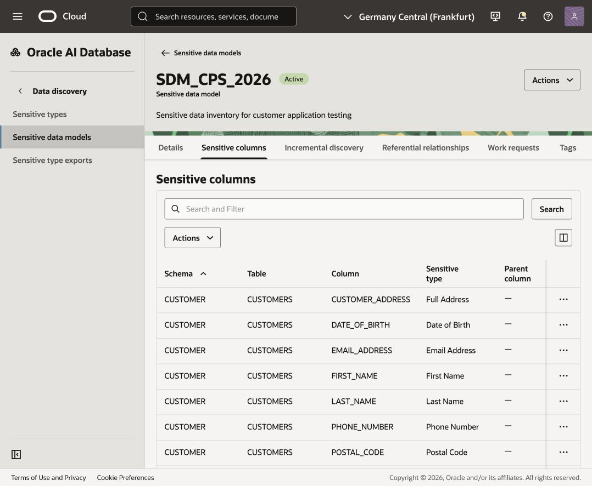
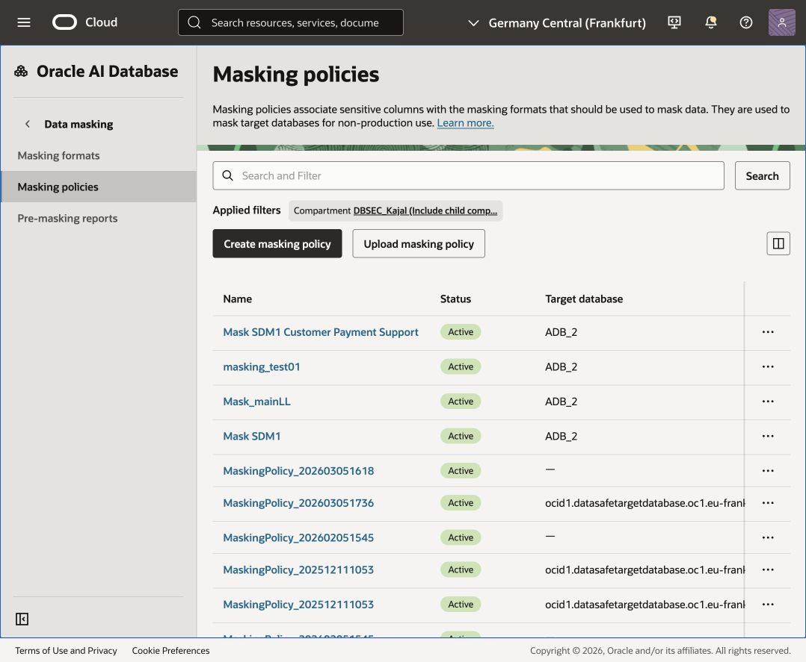
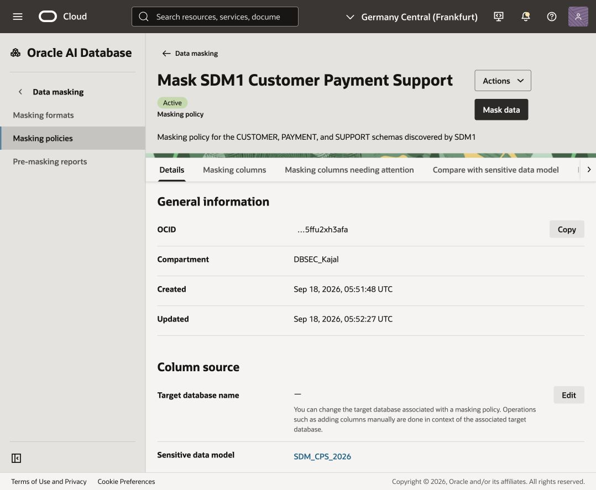
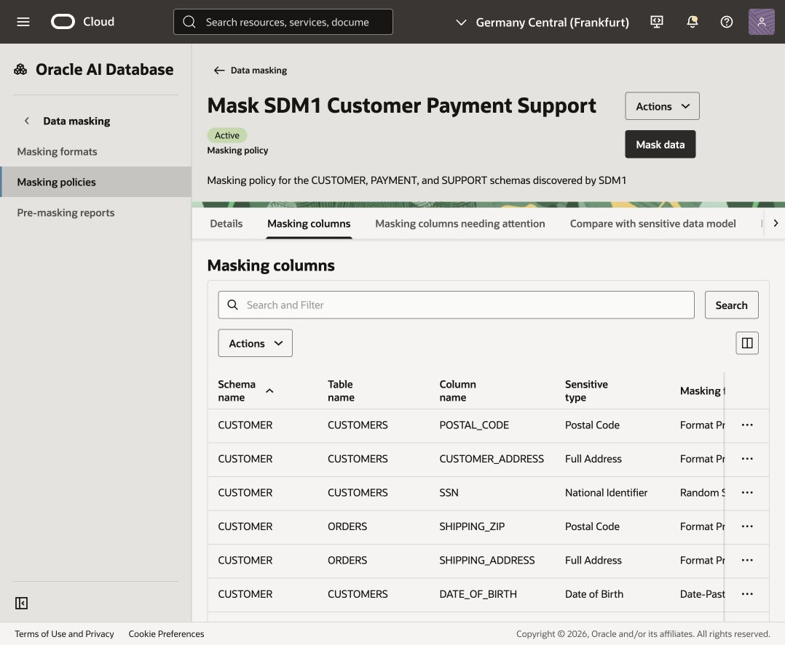
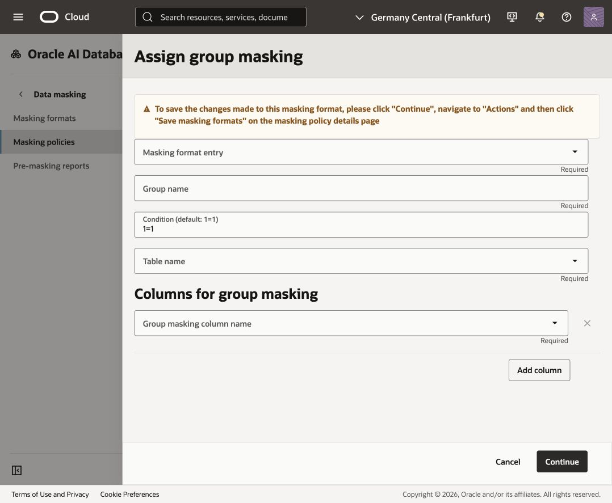
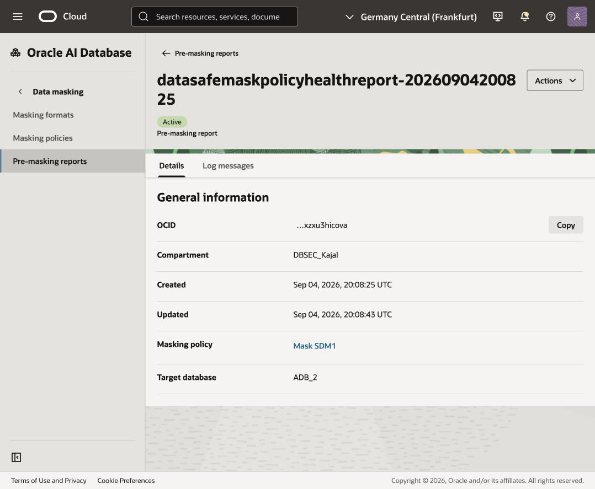
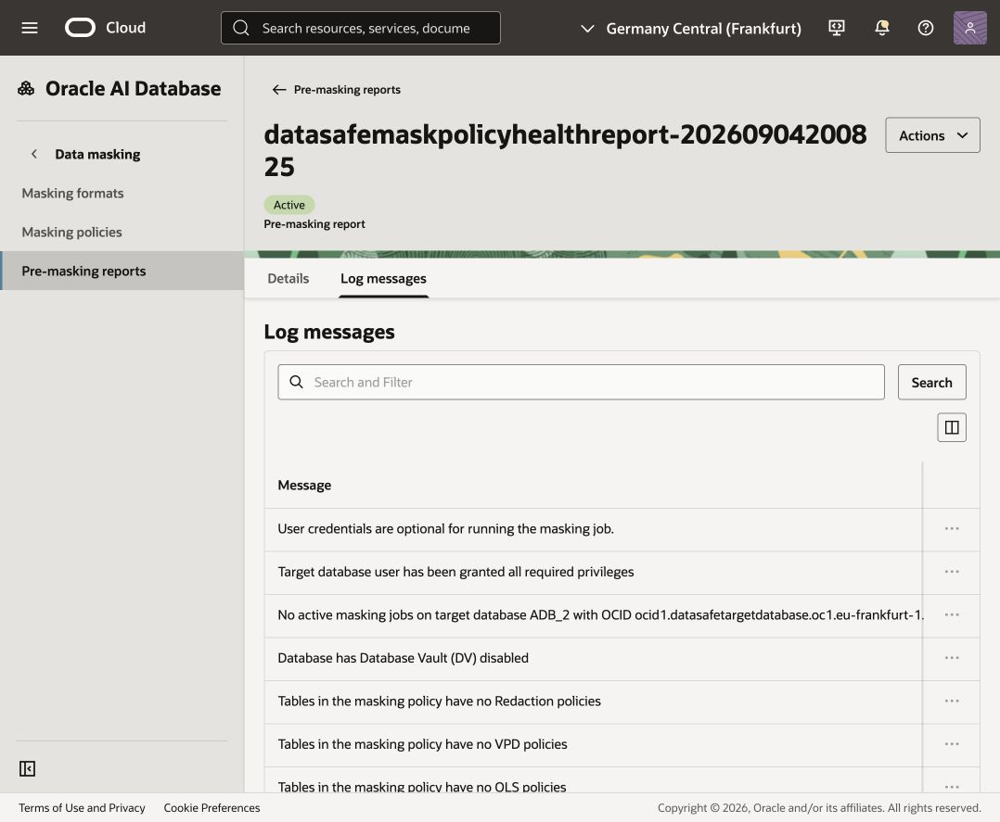

# Mask sensitive data

## Introduction

In the previous labs, you reviewed the database security posture, investigated who can access the database, and discovered where sensitive information resides.

Data Discovery identified sensitive columns in the `CUSTOMER`, `PAYMENT`, and `SUPPORT` schemas and recorded them in the sensitive data model `SDM1`. That model is now the inventory for the data that must be protected before a test copy is shared with the application team.

The application team needs realistic records to test customer profiles, orders, payments, and support tickets. However, the team does not need access to real names, contact details, dates of birth, national identifiers, addresses, or payment-card holder names. A masking policy replaces those values with safe, usable values while retaining the structure needed for testing.

Subsetting and masking will be run together later to create a smaller, protected copy for the application team.

### Scenario

Continue acting as the database security administrator. The discovery work is complete, and `SDM1` now covers the sensitive data needed for the retail application test scenario.

The next control is to create a masking policy from `SDM1`. You will review the generated column mappings, keep the generated masking formats, group related address values so that they remain meaningful together, and perform a pre-masking check.

After the pre-masking check, the next lab step will run subsetting and masking together. 
This lab intentionally stops after the pre-masking check. Do not select **Mask data** or start a masking job.

Estimated Time: 20 minutes

### Objectives

In this lab, you will:

- Grant the Data Masking role on the target database when working in your own tenancy
- Create a masking policy from `SDM1`
- Review the generated masking columns and confirm compatible masking formats
- Create group masks for related address values
- Perform a pre-masking check

### Prerequisites

This lab assumes you have:

- An Oracle Cloud account and access to the Oracle Cloud Infrastructure Console
- Access to a registered target database containing the `CUSTOMER`, `PAYMENT`, and `SUPPORT` schemas
- An active sensitive data model named `SDM1` created in the Data Discovery lab
- The Data Masking role granted on the target database when working in your own tenancy

### Assumptions

- Your compartment name, target database name, dates, and discovery results can differ from the screenshots.
- `SDM1` contains 13 sensitive columns across four tables. If your model has a different count, use the columns shown in your own model.

## Task 1 (For your tenancy only): Grant the Data Masking role on your target database

Perform this task only if you are working in your own tenancy. If you are using a LiveLabs sandbox, you do not need to perform this task.

1. Return to the SQL worksheet in Database Actions. If you are prompted to sign in to your target database, sign in as the `ADMIN` user. Clear the worksheet and the **Script Output** tab.

2. On the SQL worksheet, enter the following command to grant the Data Masking role to the Oracle Data Safe service account on your target database.

   `<copy>EXECUTE DS_TARGET_UTIL.GRANT_ROLE('DS$DATA_MASKING_ROLE');</copy>`

3. On the toolbar, select the **Run Statement** button (the green circle with a white arrow) to execute the command.

4. Verify that the Script Output reads:

   `PL/SQL procedure successfully completed.`

   `You are now able to mask sensitive data on your target database.`

5. Clear the worksheet and Script Output before continuing.

## Task 2: Review the sensitive columns in your target database

Review the tables that contain the sensitive columns identified by `SDM1`.

1. Return to the SQL worksheet in Database Actions. If you are prompted to sign in to your target database, sign in as the `ADMIN` user. Clear the worksheet and the **Script Output** tab if you did not just complete Task 1.

2. On the **Navigator** tab, select each schema below and review the listed table:

   | Schema | Table | Sensitive columns in the captured model |
   | --- | --- | --- |
   | `CUSTOMER` | `CUSTOMERS` | `CUSTOMER_ADDRESS`, `DATE_OF_BIRTH`, `EMAIL_ADDRESS`, `FIRST_NAME`, `LAST_NAME`, `PHONE_NUMBER`, `POSTAL_CODE`, `SSN` |
   | `CUSTOMER` | `ORDERS` | `SHIPPING_ADDRESS`, `SHIPPING_ZIP` |
   | `PAYMENT` | `PAYMENTS` | `CARDHOLDER_NAME` |
   | `SUPPORT` | `SUPPORT_TICKETS` | `CONTACT_EMAIL`, `CONTACT_PHONE` |

3. Drag a table to the worksheet. The existing masking lab uses the Navigator drag-and-drop interaction shown below. In this lab, repeat the interaction for `CUSTOMER.CUSTOMERS`, `CUSTOMER.ORDERS`, `PAYMENT.PAYMENTS`, and `SUPPORT.SUPPORT_TICKETS`.

4. When prompted for an insertion type, select **Select**, and then select **Apply**.

5. Review the generated SQL on the worksheet.

6. On the toolbar, select **Run Script**.

7. On the **Script Output** tab, review the column headings against the `SDM1` inventory. Do not record row values.

8. Repeat steps 3 through 7 for the remaining tables. Keep the Database Actions browser tab open because you return to it later.

The reference visual above shows the authoritative inventory for this task: use the `CUSTOMER`, `PAYMENT`, and `SUPPORT` schemas and the tables listed above.

## Task 3: Create a masking policy from SDM1

Data Masking can generate a masking policy from a sensitive data model. It pulls the columns from the model and suggests a masking format for each column.

1. Return to the Oracle Data Safe browser tab and navigate to the **Data masking** landing page.

2. Under **Data masking**, select **Masking policies**.

3. Next to **Applied filters**, select your compartment without child compartments.

4. Select **Create masking policy**. The **Create masking policy** page opens.

5. Configure the masking policy as follows:

   - **Name:** `Mask_SDM1`
   - **Compartment:** Your workshop compartment
   - **Description:** `Masking policy for the CUSTOMER, PAYMENT, and SUPPORT schemas discovered by SDM1`
   - **Choose how you want to create the masking policy:** Leave **Using a sensitive data model** selected.
   - **Sensitive Data Model:** Select the compartment containing `SDM1`, and then select `SDM1`.

6. Select **Create masking policy**.

7. Wait for the operation to complete and for the masking policy to become **Active**. Do not close the creation panel while Data Safe is adding the model columns to the policy.

### Review the generated policy and masking formats

Review the generated policy and its masking formats before continuing. The reference visuals in this section show the policy generated from the 13-column `SDM1` inventory for this lab. Target names, timestamps, and compartment names can differ in your tenancy, but the table and column inventory should match.

1. On the masking policy page, review the **Details** tab.

2. Under **General information**, confirm that the policy name is `Mask_SDM1` and that it is linked to the `SDM1` discovery inventory.

3. Under **Column source**, confirm that the target database is the database used by the discovery lab.

4. Under **Masking options**, review the configured options, including temporary tables, redo logging, statistics refreshing, degree of parallelism, and recompilation.

5. Select the **Masking columns** tab. Confirm that the policy contains these 13 columns and the generated formats:

   | Schema | Table | Column | Generated format |
   | --- | --- | --- | --- |
   | `CUSTOMER` | `CUSTOMERS` | `CUSTOMER_ADDRESS` | Format Preserving Randomization |
   | `CUSTOMER` | `CUSTOMERS` | `DATE_OF_BIRTH` | Date-Past |
   | `CUSTOMER` | `CUSTOMERS` | `EMAIL_ADDRESS` | Email Address |
   | `CUSTOMER` | `CUSTOMERS` | `FIRST_NAME` | Random Name |
   | `CUSTOMER` | `CUSTOMERS` | `LAST_NAME` | Random Name |
   | `CUSTOMER` | `CUSTOMERS` | `PHONE_NUMBER` | US Phone Number |
   | `CUSTOMER` | `CUSTOMERS` | `POSTAL_CODE` | Format Preserving Randomization |
   | `CUSTOMER` | `CUSTOMERS` | `SSN` | Random String |
   | `CUSTOMER` | `ORDERS` | `SHIPPING_ADDRESS` | Format Preserving Randomization |
   | `CUSTOMER` | `ORDERS` | `SHIPPING_ZIP` | Format Preserving Randomization |
   | `PAYMENT` | `PAYMENTS` | `CARDHOLDER_NAME` | Random Name |
   | `SUPPORT` | `SUPPORT_TICKETS` | `CONTACT_EMAIL` | Email Address |
   | `SUPPORT` | `SUPPORT_TICKETS` | `CONTACT_PHONE` | US Phone Number |

6. Review the generated format for each column against the table above. No format changes are required for this lab; keep the generated formats and return to the masking columns table if a column is missing.

The masking policy is the bridge between the discovery inventory and the protection step: `SDM1` identifies what must be protected, and `Mask_SDM1` carries the generated formats into the later subsetting-and-masking operation.

## Task 4: Create group masks

Use group masking so that an address and its corresponding postal code remain a meaningful pair after masking. Create one group for customer addresses and one group for order shipping addresses. The two groups are independent because they preserve relationships within different tables.

### Customer address group

1. On the **Masking columns** tab, under **Masking columns**, open the **Actions** menu above the table and select **Assign group masking**. Do not use the top policy **Actions** menu or the three-dot menu on an individual row.

2. For **Masking format entry**, select **Shuffle**.

3. For **Group name**, enter `Customer_Address`.

4. Leave **Condition** at its default value of `1=1`.

5. For **Table name**, select `CUSTOMER.CUSTOMERS`.

6. Leave the optional **Group columns** field blank for this lab. It is used only when the shuffle needs to be partitioned by a reference column.

7. Under **Columns for group masking**, in the **Group masking column name** drop-down list, select `CUSTOMER_ADDRESS`.

8. Select **Add column**. In the new **Group masking column name** drop-down list, select `POSTAL_CODE`.

9. Select **Continue**. Confirm that both columns show the `Customer_Address` masking group.

### Shipping address group

1. From the **Actions** menu above the masking-columns table, select **Assign group masking** again.

2. Select **Shuffle** for **Masking format entry**.

3. Enter `Shipping_Address` for **Group name**.

4. Leave **Condition** at its default value of `1=1`.

5. Select `CUSTOMER.ORDERS` for **Table name**.

6. Leave the optional **Group columns** field blank for this lab.

7. Under **Columns for group masking**, select `SHIPPING_ADDRESS` in the first **Group masking column name** field.

8. Select **Add column**, and then select `SHIPPING_ZIP` in the new **Group masking column name** field.

9. Select **Continue** and confirm that both columns show the `Shipping_Address` masking group.

10. From the **Actions** menu, select **Save masking formats**. Wait for the save operation to complete.

The groups preserve the relationship within each address record. They do not cause customer addresses and shipping addresses to share values, and they do not change the `CUSTOMER_ID` or other non-sensitive key columns.

## Task 5: Perform a pre-masking check

The pre-masking check looks for known issues that could prevent a masking run, such as missing privileges or insufficient tablespace. It does not mask data.

1. On the left, select **Pre-masking reports**.

2. Select **Pre-masking check**.

3. Select the compartment for the target database, if needed, and then select the target database used by `SDM1`.

4. Select the compartment for the masking policy, if needed, and then select `Mask_SDM1`.

5. For **Pre-masking report compartment**, select your workshop compartment.

6. Select **Submit** and wait for the status to change to **Active**. The **Work requests** tab opens.

7. Select the **Log messages** tab and verify the result of each check. Review the **Work requests** tab as well and confirm that the pre-check operations succeeded.

If a check fails, record the message and resolve the issue before any masking run. Do not select **Mask data**.

This completes the lab. The next lab step will run subsetting and masking together to produce the smaller, protected copy; do not select **Mask data** here.

### Learn More

- [Data Masking Overview](https://docs.oracle.com/iaas/data-safe/doc/data-masking-overview.html)

### Acknowledgements

- Author - Jody Glover, Lead Principal User Assistance Developer, Database Development
- Contributor - Kajal Singh, Product Manager, Oracle Database Security
- Last Updated By/Date - Kajal Singh, September 17, 2026
