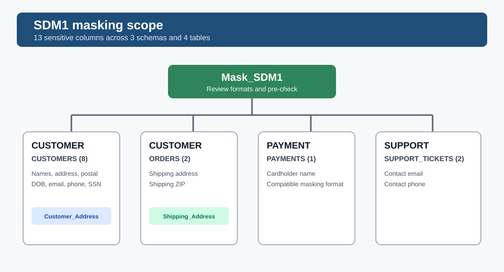
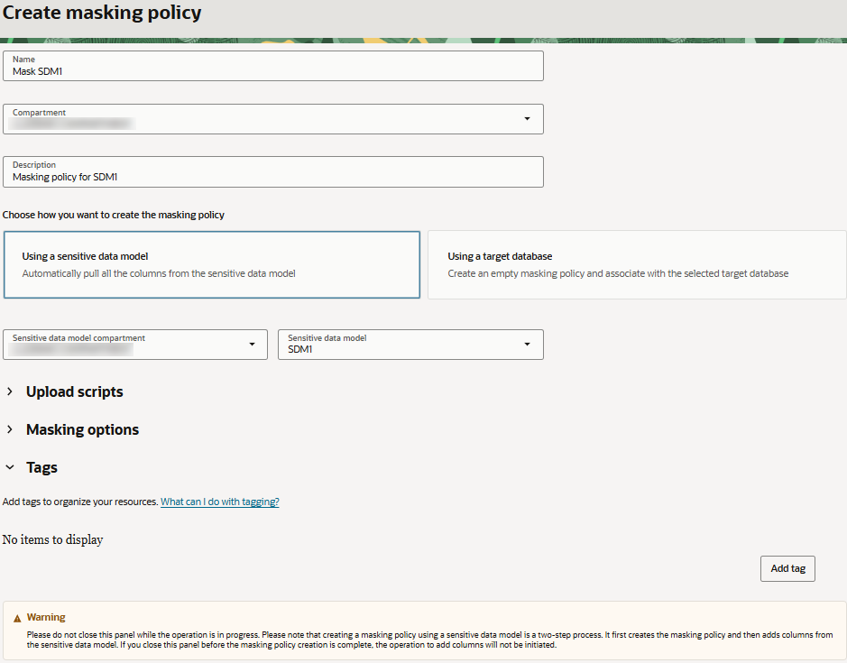
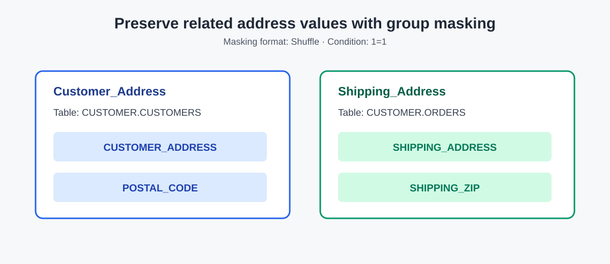
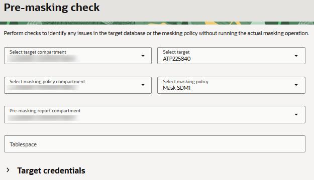

# Mask sensitive data

## Introduction

In the previous labs, you reviewed the database security posture, investigated who can access the database, and discovered where sensitive information resides.

Data Discovery identified sensitive columns in the CUSTOMER, PAYMENT, and SUPPORT schemas and recorded them in the sensitive data model SDM1. That model is now the inventory for the data that must be protected before a test copy is shared with the application team.

The application team needs realistic records to test customer profiles, orders, payments, and support tickets. However, the team does not need access to real names, contact details, dates of birth, national identifiers, addresses, or payment-card holder names. A masking policy replaces those values with safe, usable values while retaining the structure needed for testing.

### Scenario

Continue acting as the database security administrator. The discovery work is complete, and SDM1 now covers the sensitive data needed for the retail application test scenario.

The next control is to create a masking policy from SDM1. You will review the generated column mappings, confirm that the values have compatible masking formats, group related address values so that they remain meaningful together, and perform a pre-masking check.

This lab intentionally stops after the pre-masking check. Do not select Mask data or start a masking job.

Estimated Time: 20 minutes

### Objectives

In this lab, you will:

- Review the sensitive columns identified by SDM1
- Create a masking policy from SDM1
- Review the generated masking columns and formats
- Preserve relationships between related address values by using group masking
- Perform a pre-masking check

### Prerequisites

This lab assumes you have:

- An Oracle Cloud account and access to the Oracle Cloud Infrastructure Console
- Access to a registered target database containing the CUSTOMER, PAYMENT, and SUPPORT schemas
- An active sensitive data model named SDM1 created in the Data Discovery lab
- Permissions to create and update masking policies in your compartment
- The ADMIN password for the target database, if Database Actions prompts you to sign in

### Assumptions

- Your compartment name, target database name, dates, and discovery results can differ from the screenshots.
- SDM1 contains 13 sensitive columns across four tables. If your model has a different count, use the columns shown in your own model.

## Task 1: Review the sensitive columns in your target database

Review the tables that contain the sensitive columns identified by SDM1.

1. Return to the SQL worksheet in Database Actions. If prompted, sign in as the ADMIN user. Clear the worksheet and the Script Output tab.

2. On the Navigator tab, select each schema below and review the listed table:

   | Schema | Table | Sensitive columns in the captured model |
   | --- | --- | --- |
   | CUSTOMER | CUSTOMERS | CUSTOMER_ADDRESS, DATE_OF_BIRTH, EMAIL_ADDRESS, FIRST_NAME, LAST_NAME, PHONE_NUMBER, POSTAL_CODE, SSN |
   | CUSTOMER | ORDERS | SHIPPING_ADDRESS, SHIPPING_ZIP |
   | PAYMENT | PAYMENTS | CARDHOLDER_NAME |
   | SUPPORT | SUPPORT_TICKETS | CONTACT_EMAIL, CONTACT_PHONE |

3. Drag a table to the worksheet. When prompted for an insertion type, select Select, and then select Apply.

4. Review the generated SQL and select Run Script.

5. On the Script Output tab, confirm that the table contains the columns identified by Data Discovery. Do not copy real row values into screenshots or lab notes.

6. Repeat steps 3 through 5 for the remaining tables. Keep the Database Actions browser tab open because you return to it later.

The captured SDM1 inventory contains 13 sensitive columns: eight in CUSTOMER.CUSTOMERS, two in CUSTOMER.ORDERS, one in PAYMENT.PAYMENTS, and two in SUPPORT.SUPPORT_TICKETS.

## Task 2: Create a masking policy from SDM1

Data Masking can generate a masking policy from a sensitive data model. It pulls the columns from the model and suggests a masking format for each column.

1. Return to the Oracle Data Safe browser tab and navigate to the Data masking landing page.

2. Under Data masking, select Masking policies.

3. Next to Applied filters, select your compartment without child compartments.

4. Select Create masking policy. The Create masking policy page opens.

5. Configure the masking policy as follows:

   - Name: Mask SDM1
   - Compartment: Your workshop compartment
   - Description: Masking policy for SDM1 customer, payment, and support data
   - Choose how you want to create the masking policy: Leave Using a sensitive data model selected.
   - Sensitive Data Model: Select the compartment containing SDM1, and then select SDM1.

6. Select Create masking policy.

7. Wait for the operation to complete and for the masking policy to become Active. Do not close the creation panel while Data Safe is adding the model columns to the policy.

## Task 3: Review the generated masking policy

Review the policy before changing any formats.

1. On the masking policy page, review the Details tab.

2. Under General information, confirm that the policy name is Mask SDM1 and that the sensitive data model is SDM1.

3. Under Column source, confirm that the target database is the database used by the discovery lab.

4. Under Masking options, review the configured options, including temporary tables, redo logging, statistics refreshing, degree of parallelism, and recompilation.

5. Select the Masking columns tab. Confirm that the policy contains the sensitive columns from all three schemas:

   - CUSTOMER.CUSTOMERS
   - CUSTOMER.ORDERS
   - PAYMENT.PAYMENTS
   - SUPPORT.SUPPORT_TICKETS

6. Review the default masking format for each column. Every sensitive column should have a compatible masking format. If a column is missing, return to the SDM1 model and verify that the discovery results were approved and applied before continuing.

The masking policy is the bridge between the discovery inventory and the protection step: SDM1 identifies what must be protected, and the policy defines how each value will be transformed.

## Task 4: Confirm masking formats for sensitive values

Review the automatically selected formats and adjust them only when the default does not meet the test requirement.

1. On the Masking columns tab, locate a sensitive column such as SSN in CUSTOMER.CUSTOMERS.

2. Select the three-dot menu for the row, and then select View/Edit masking format. The Edit format entry panel opens.

3. Confirm that the selected format is compatible with the column data type and does not preserve the original value. If you change the format, select a compatible random or deterministic masking format offered by the console.

4. Select Update.

5. Repeat the review for the name, date-of-birth, email, phone, cardholder-name, and support-contact columns. Keep the automatically selected format when it is already appropriate.

6. From the Actions menu, select Save masking formats. Wait for the save operation to finish before continuing.

Do not use a masking format that exposes the original value, and do not remove a sensitive column from the policy merely because it is not needed for the first test query.

## Task 5: Group related customer and shipping address values

Use group masking so that an address and its corresponding postal code remain a meaningful pair after masking. Create one group for customer addresses and one group for order shipping addresses.

### Customer address group

1. On the Masking columns tab, open the Actions menu and select Assign group masking.

2. For Masking format entry, select Shuffle.

3. For Group name, enter Customer_Address.

4. For Condition, enter 1=1.

5. For Table name, select CUSTOMER.CUSTOMERS.

6. Add the following columns one at a time using Group masking column name and Add column:

   - CUSTOMER_ADDRESS
   - POSTAL_CODE

7. Select Continue. Confirm that the two columns show the Customer_Address masking group.

### Shipping address group

1. Open Actions and select Assign group masking again.

2. Select Shuffle for Masking format entry.

3. Enter Shipping_Address for Group name.

4. Enter 1=1 for Condition.

5. Select CUSTOMER.ORDERS for Table name.

6. Add the following columns:

   - SHIPPING_ADDRESS
   - SHIPPING_ZIP

7. Select Continue and confirm that both columns show the Shipping_Address masking group.

8. From the Actions menu, select Save masking formats. Wait for the save operation to complete.

The groups preserve the relationship within each address record. They do not cause customer addresses and shipping addresses to share values, and they do not change the CUSTOMER_ID or other non-sensitive key columns.

## Task 6: Perform a pre-masking check

The pre-masking check looks for known issues that could prevent a masking run, such as missing privileges or insufficient tablespace. It does not mask data.

1. On the left, select Pre-masking reports.

2. Select Pre-masking check.

3. Select the compartment for the target database, if needed, and then select the target database used by SDM1.

4. Select the compartment for the masking policy, if needed, and then select Mask SDM1.

5. For Pre-masking report compartment, select your workshop compartment.

6. Select Submit and wait for the status to change to Active. The Work requests tab opens.

7. Select the Log messages tab and verify the result of each check. Review the Work requests tab as well and confirm that the pre-check operations succeeded.

If a check fails, record the message and resolve the issue before any masking run. Do not select Mask data.

## Stop here

The masking policy has been created from SDM1, the sensitive columns have been reviewed, and the pre-masking check has been performed. Do not start a masking job in this lab. The masking operation and post-masking validation will be covered separately.

### Learn More

- [Data Masking Overview](https://docs.oracle.com/iaas/data-safe/doc/data-masking-overview.html)

### Acknowledgements

- Author - Jody Glover, Lead Principal User Assistance Developer, Database Development
- Contributor - Kajal Singh, Product Manager, Oracle Database Security
- Last Updated By/Date - Kajal Singh, September 17, 2026

