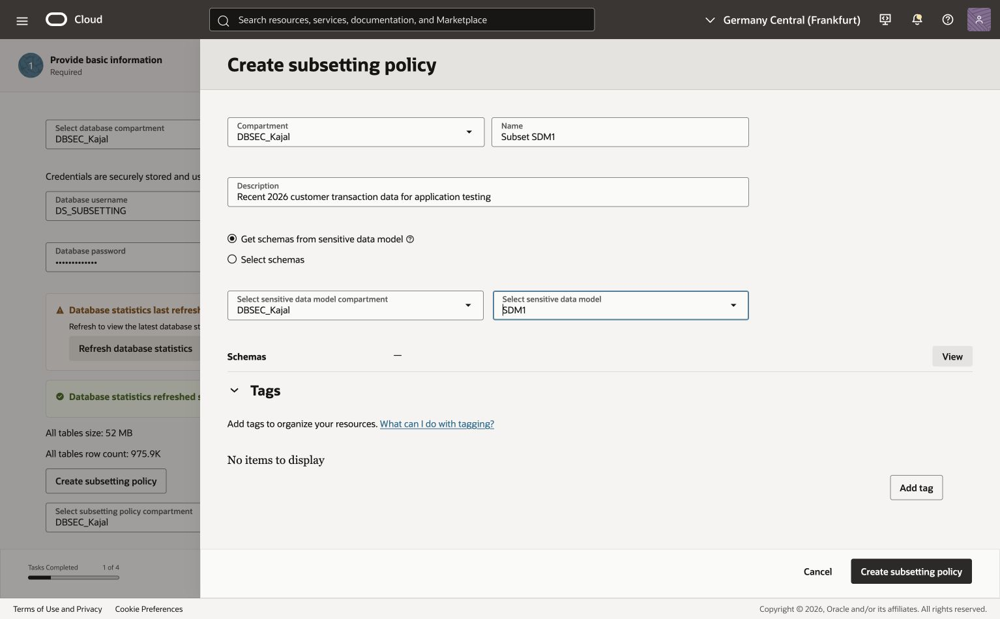
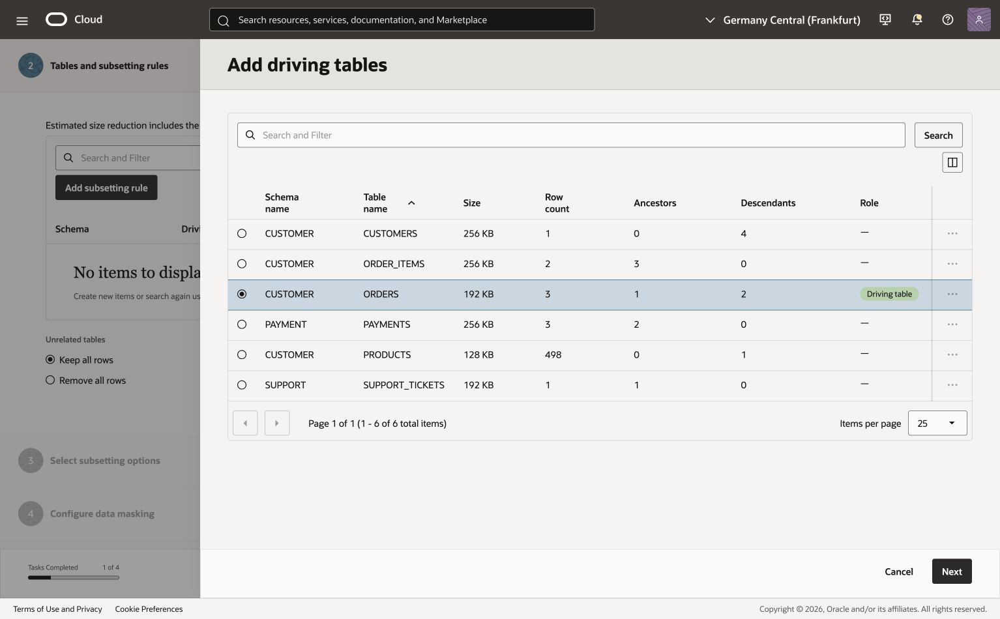
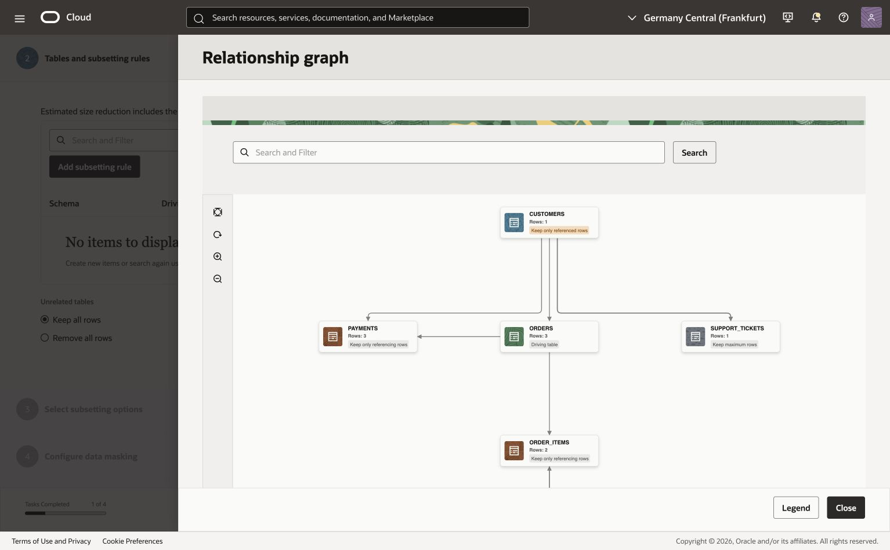
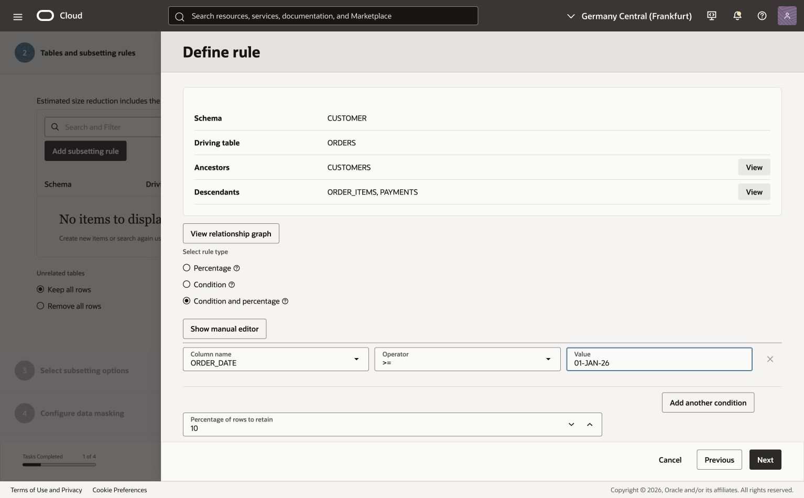
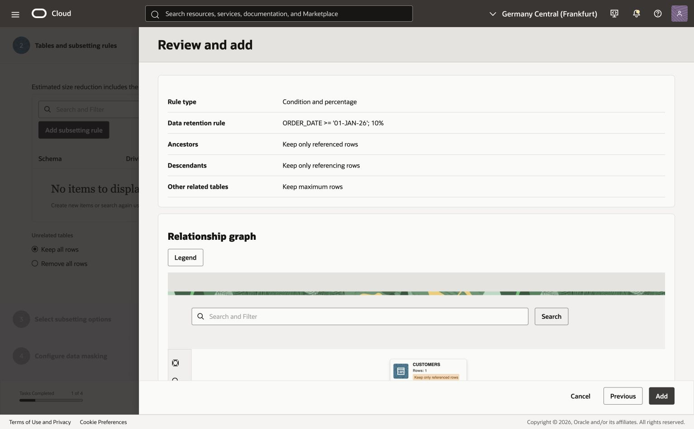
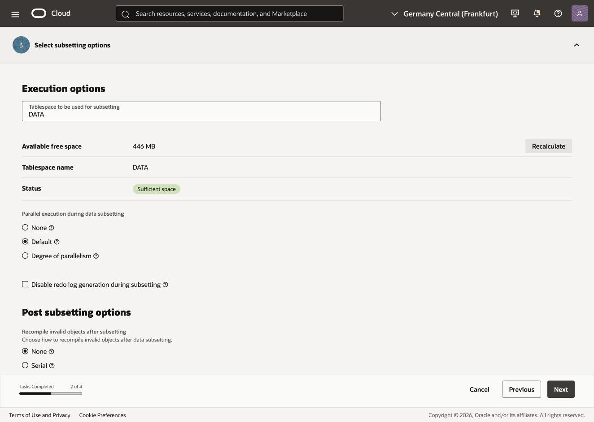
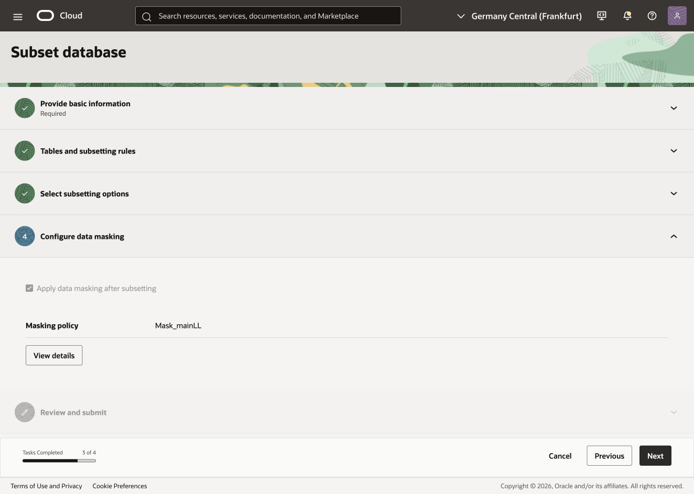
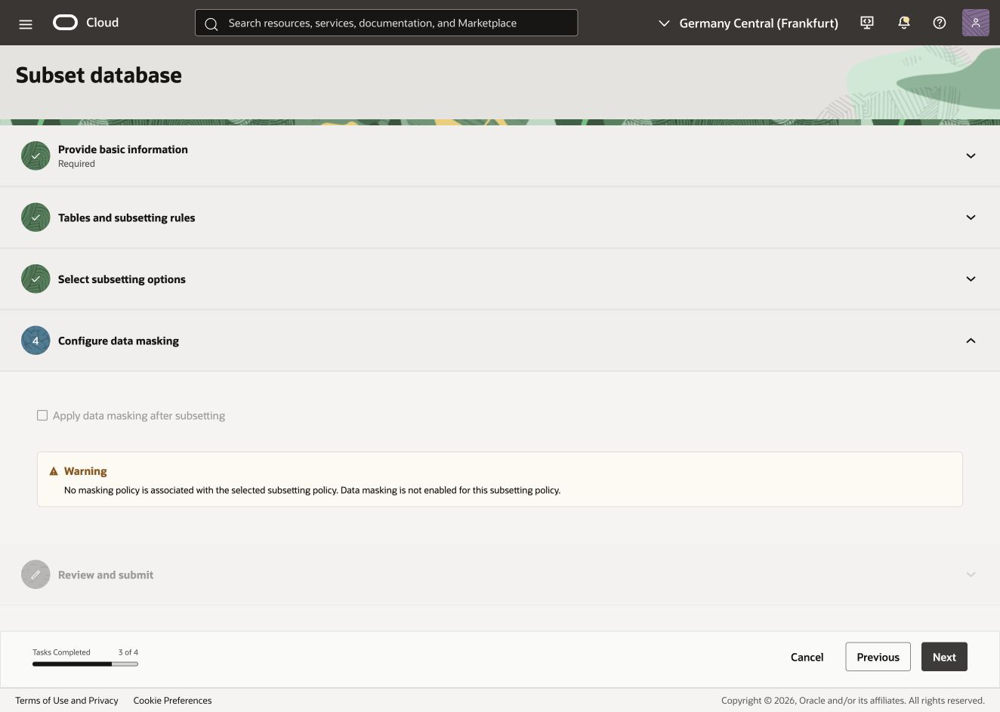
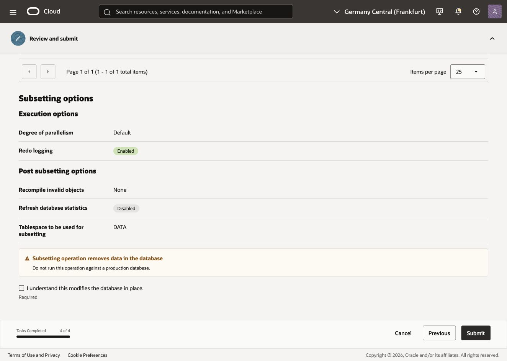

# Subset data

## Introduction

The application team needs a smaller, protected copy of the retail application data for testing customer profiles, orders, payments, and support tickets.

In the preceding labs, you created the sensitive data model `SDM1`, built the masking policy `Mask_SDM1`, and completed its pre-masking check. In this lab, you configure the subsetting policy, then use **Subset database** from the Data subsetting overview to run subsetting and apply that existing masking policy in one operation.

The subsetting policy, `Subset SDM1`, retains 10% of the `CUSTOMER.ORDERS` rows dated January 1, 2026 or later, together with the related rows needed by the application. Data masking then protects sensitive values in the retained data.

Estimated Time: 20 minutes

### Objectives

- Prepare the database and access required for subsetting.
- Configure subsetting rules and review table relationships.
- Run subsetting with the existing masking policy.
- Validate the resulting data and job reports.

### Task 1: Before you begin

1. Confirm that you have access to Oracle Data Safe and the registered workshop target database containing the `CUSTOMER`, `PAYMENT`, and `SUPPORT` schemas. The reference screenshots use `ADB_2`; use your workshop database and compartment.
2. Use a prepared non-production copy of the data. **Subsetting modifies the selected database in place**; this workflow does not create a new database or clone. Confirm that the workshop copy can be restored before running the job.
3. Confirm that `SDM1` is available and includes the three application schemas and their required relationships.
4. Confirm that the masking policy `Mask_SDM1` from the [Mask sensitive data lab](../mask-sensitive-data/mask-sensitive-data-2026.md) is Active, its masking formats are saved, and its pre-masking check has passed for this target database.
5. Confirm with your administrator that the target's Data Safe service account has the required Data Subsetting and Data Masking roles. Your OCI account also needs permission to use the policies and work requests and to manage subsetting and masking reports in the target database's compartment.
6. Connect to this same workshop database in Database Actions or SQL Developer with an account that can query the application tables. Run the following statements and save the counts for comparison after the job.

```sql
SELECT 'CUSTOMER.ORDERS' AS table_name, COUNT(*) AS rows_before FROM CUSTOMER.ORDERS
UNION ALL
SELECT 'CUSTOMER.CUSTOMERS', COUNT(*) FROM CUSTOMER.CUSTOMERS
UNION ALL
SELECT 'CUSTOMER.ORDER_ITEMS', COUNT(*) FROM CUSTOMER.ORDER_ITEMS
UNION ALL
SELECT 'PAYMENT.PAYMENTS', COUNT(*) FROM PAYMENT.PAYMENTS
UNION ALL
SELECT 'SUPPORT.SUPPORT_TICKETS', COUNT(*) FROM SUPPORT.SUPPORT_TICKETS;

SELECT COUNT(*) AS recent_orders_before
FROM CUSTOMER.ORDERS
WHERE ORDER_DATE >= DATE '2026-01-01';
```

The `recent_orders_before` result is the population to which the 10% rule will apply. Row counts for related tables follow the relationship settings and need not fall by the same percentage. Keep Database Actions or SQL Developer available for Task 5.

### Task 2: Create the DS_SUBSETTING database user

The Subset database workflow requires target-database credentials to refresh statistics, calculate estimates, and run the job. Have a database administrator create `DS_SUBSETTING` for this purpose. It is a dedicated database user, separate from the Oracle Data Safe service account created during target registration.

Connect to the target database as `ADMIN`, `SYS`, or another account that can create users and grant roles, then run the following. Replace `<strong-password>` with a password that meets your database password policy; store it securely because you will enter it in the Data Safe workflow.

```sql
CREATE USER DS_SUBSETTING IDENTIFIED BY "<strong-password>"
  DEFAULT TABLESPACE "DATA"
  TEMPORARY TABLESPACE "TEMP";

GRANT CREATE SESSION TO DS_SUBSETTING;
GRANT DS$DATA_SUBSETTING_ROLE TO DS_SUBSETTING;

ALTER USER DS_SUBSETTING ACCOUNT UNLOCK;
```

The example uses the Autonomous Database tablespaces `DATA` and `TEMP`. For another database type, use the tablespaces supplied by your DBA. Keep the `DS_SUBSETTING` username and password available for the wizard; this user does not replace the registered Data Safe service account. Ensure the required privileges for the combined subsetting and masking operation are in place before submission.

### Task 3: Complete the Subset database workflow

Use the **Subset database** workflow from start to finish. In this workflow, step 1 creates the new subsetting policy and step 2 adds its subsetting rules. Do not create the policy or rules separately from the **Subsetting policies** page for this walkthrough.

The workflow uses the masking policy created in the preceding masking lab. In this lab, use the existing `Mask_SDM1`; do not create another masking policy. The screenshots show a reference environment, so database names, compartments, schemas, counts, and estimates may differ.

1. In **Data Safe**, open **Data subsetting**, then **Overview**. Select **Subset database**.

   

#### Wizard step 1: Provide basic information

1. Select the target database compartment and database from Task 1. Enter the `DS_SUBSETTING` username and the password created in Task 2. These credentials are used to refresh statistics, calculate estimates, run the subsetting job, and apply masking when configured.
2. Select **Refresh database statistics** and wait for the refresh to complete before continuing.
3. Select **Create subsetting policy**. In the creation panel, enter the following values:

   | Field | Value |
   | --- | --- |
   | Compartment | Your workshop compartment |
   | Name | `Subset SDM1` |
   | Description | `Recent 2026 customer transaction data for application testing` |
   | Policy source | **Get schemas from sensitive data model** |
   | Sensitive data model compartment | The compartment containing `SDM1` |
   | Sensitive data model | `SDM1` |

   

4. Select **View** beside **Schemas** and confirm that the model contains the schemas required by this lab. For the reference workflow, these are `CUSTOMER`, `PAYMENT`, and `SUPPORT`. Select **Close** to return to the creation panel.
5. Select **Create subsetting policy**. When the policy is created, select `Subset SDM1` in the wizard and select **Next** to open **Tables and subsetting rules**.

#### Wizard step 2: Tables and subsetting rules

1. A newly created policy starts with no subsetting rules. Select **Add subsetting rule**.
2. In **Add driving tables**, select the row whose schema is `CUSTOMER` and table is `ORDERS`. Review the ancestor and descendant counts, then select **Next**.

   

3. In **Define rule**, select **View relationship graph** before finalizing the rule. Use the graph to follow `ORDERS` to its related tables, including `CUSTOMERS`, `ORDER_ITEMS`, and `PAYMENTS`. Select **Legend** to understand the table roles, use **Fit to canvas** or the zoom controls as needed, and select **Close** to return to **Define rule**.

   

4. Under **Select rule type**, select **Condition and percentage**. Enter:

   | Field | Value |
   | --- | --- |
   | Column name | `ORDER_DATE` |
   | Operator | `>=` |
   | Value | `01-JAN-26` |
   | Percentage of rows to retain | `10` |

   The condition is evaluated first, and 10% of the matching `CUSTOMER.ORDERS` rows are retained. The equivalent SQL date predicate is `ORDER_DATE >= DATE '2026-01-01'`.

5. Under **Ancestors**, select **Keep only referenced rows** to retain the customers referenced by the retained orders.
6. Under **Descendants**, select **Keep only referencing rows** to retain the related order items and payments. Leave **Remove all rows** unselected.
7. Under **Other related tables**, select **Keep maximum rows** for this lab. The 10% setting applies to the condition-matching driving-table rows; it does not independently limit every related table.

   

8. Select **Next** to open **Review and add**. Verify the condition, percentage, ancestor action, descendant action, other-related-table action, and relationship graph.

   

9. Select **Add**. Wait while Data Safe adds the rule and recalculates the table estimates. Confirm that `CUSTOMER.ORDERS` appears under **Tables and subsetting rules** with **Condition and percentage**, `ORDER_DATE >= '01-JAN-26'`, and `10%`. Use **Add subsetting rule** again if the workflow requires additional driving-table rules. When the rules are complete, select **Next**.

#### Wizard step 3: Select subsetting options

1. Review **Tablespace to be used for subsetting**. Use the tablespace supplied by your DBA; `DATA` is the Autonomous Database example used here. If you leave the field blank, the database user's default tablespace is used.
2. Review **Available free space** and **Status**. If you change the tablespace, select **Recalculate** and confirm that the status shows **Sufficient space** before continuing.
3. Under **Parallel execution during data subsetting**, retain **Default** for this lab unless your DBA directs otherwise. **None** disables parallel execution; **Degree of parallelism** lets you enter a degree.
4. Leave **Disable redo log generation during subsetting** unselected for this lab.
5. Under **Post subsetting options**, retain **None** for **Recompile invalid objects after subsetting**, and leave **Refresh database statistics after subsetting** unselected unless your DBA directs otherwise. These are the example settings, not requirements for every database.

   

6. Select **Next** to open **Configure data masking**.

#### Wizard step 4: Configure data masking

1. Confirm that **Apply data masking after subsetting** is checked and **Masking policy** shows **Mask_SDM1**. In this console version, these values are inherited from the association with the previously created masking policy and the checkbox is read-only. The workflow consumes `Mask_SDM1`; it does not create a new masking policy.

   

2. Select **View details** to open **Masking policy details**. Review **Masking columns**, **General information**, and **Masking options**. Confirm the policy identity and the sensitive columns configured in the preceding lab across `CUSTOMER.CUSTOMERS`, `CUSTOMER.ORDERS`, `PAYMENT.PAYMENTS`, and `SUPPORT.SUPPORT_TICKETS`.
3. Select **Close** to return to the wizard.
4. If the checkbox is unchecked and you see **No masking policy is associated with the selected subsetting policy**, do not submit an unmasked run. Cancel, associate the existing `Mask_SDM1` with `Subset SDM1` using the policy association control, and restart the wizard. Do not submit an unmasked run.

   

5. Once the correct association is displayed, select **Next** to open **Review and submit**. Masking will run after subsetting as part of this operation; do not launch a separate masking job.

#### Wizard step 5: Review and submit

1. Review **Review changes** and **Rules**. Confirm the following values:

   | Item | Expected value |
   | --- | --- |
   | Database | The prepared workshop copy from Task 1 |
   | Subsetting policy | `Subset SDM1` |
   | Sensitive data model | `SDM1` |
   | Driving table | `CUSTOMER.ORDERS` |
   | Rule | Orders dated January 1, 2026 or later; retain 10% of matching rows |
   | Apply data masking | **Enabled** |
   | Masking policy | `Mask_SDM1` |

2. Review the estimated reduction and **Subsetting options**, including the tablespace. Verify the rule details and related-table actions against Task 3. Correct any discrepancy before submitting.
3. Read the warning that subsetting removes data. Confirm this is the restorable non-production workshop database, then select **I understand this modifies the database in place.**

   

4. Select **Submit** to start the combined operation. Keep the progress panel open and follow the work-request link when it becomes available.


### Task 4: Monitor subsetting and masking

1. Open the operation's **Work request** page and review **Details**.
2. Under **Subsetting job information**, confirm that the policy is `Subset SDM1` and wait for the subsetting job to show **Succeeded**.
3. Under **Masking job information**, confirm that the masking policy is `Mask_SDM1` and wait for the masking job to show **Succeeded**. Successful subsetting alone does not confirm that masking completed.
4. If either job fails, review **Error messages** and the work-request logs. Resolve the reported issue before treating the data as ready for application testing.
5. Follow the **View** links for the subsetting and masking reports. Review the row-count and size reduction in the subsetting report and the masked columns and job results in the masking report.


### Task 5: Review the subset and masked data

After both jobs succeed, connect to the same workshop database in SQL Developer or Database Actions. Compare these row counts with the baseline recorded in Task 1.

```sql
SELECT 'CUSTOMER.ORDERS' AS table_name, COUNT(*) AS rows_after FROM CUSTOMER.ORDERS
UNION ALL
SELECT 'CUSTOMER.CUSTOMERS', COUNT(*) FROM CUSTOMER.CUSTOMERS
UNION ALL
SELECT 'CUSTOMER.ORDER_ITEMS', COUNT(*) FROM CUSTOMER.ORDER_ITEMS
UNION ALL
SELECT 'PAYMENT.PAYMENTS', COUNT(*) FROM PAYMENT.PAYMENTS
UNION ALL
SELECT 'SUPPORT.SUPPORT_TICKETS', COUNT(*) FROM SUPPORT.SUPPORT_TICKETS;

SELECT ORDER_ID, CUSTOMER_ID, ORDER_DATE, ORDER_STATUS, ORDER_TOTAL
FROM CUSTOMER.ORDERS
WHERE ORDER_DATE >= DATE '2026-01-01'
FETCH FIRST 10 ROWS ONLY;
```

After the subsetting job and the selected masking policy complete, inspect representative sensitive columns and confirm that values are masked while the required formats remain usable:

```sql
SELECT CUSTOMER_ID, FIRST_NAME, LAST_NAME, EMAIL_ADDRESS, PHONE_NUMBER
FROM CUSTOMER.CUSTOMERS
FETCH FIRST 10 ROWS ONLY;

SELECT CARDHOLDER_NAME
FROM PAYMENT.PAYMENTS
FETCH FIRST 10 ROWS ONLY;

SELECT CONTACT_EMAIL, CONTACT_PHONE
FROM SUPPORT.SUPPORT_TICKETS
FETCH FIRST 10 ROWS ONLY;
```

Confirm that the order count is smaller than the source count, that the retained orders are from `2026-01-01` onward, and that the related rows needed by the application remain available. Confirm that the selected masking policy has run and that the sensitive values are no longer the original values while required formats remain usable.

Check that the retained orders satisfy the date condition; this query should return zero:

```sql
SELECT COUNT(*) AS orders_outside_condition
FROM CUSTOMER.ORDERS
WHERE ORDER_DATE < DATE '2026-01-01'
   OR ORDER_DATE IS NULL;
```

Use the subsetting report and the relationships reviewed in the graph to confirm that the related customer, order-item, and payment rows were retained as configured. Compare each table with its own baseline; 10% applies to the condition-matching driving-table rows, not to every table in the database.

The masking report is the record of which columns were masked. Review representative values locally for usable formats, including the customer and shipping address groups configured in the preceding lab. Do not copy sensitive row values into the lab or screenshots.

### Learn More

- [Data Subsetting overview](https://docs.oracle.com/en/cloud/paas/data-safe/udscs/data-subsetting-overview.html)

### Acknowledgements

- Author - Jody Glover, Lead Principal User Assistance Developer, Database Development
- Contributor - Kajal Singh, Product Manager, Oracle Database Security
- Last Updated By/Date - Kajal Singh, September 21, 2026
