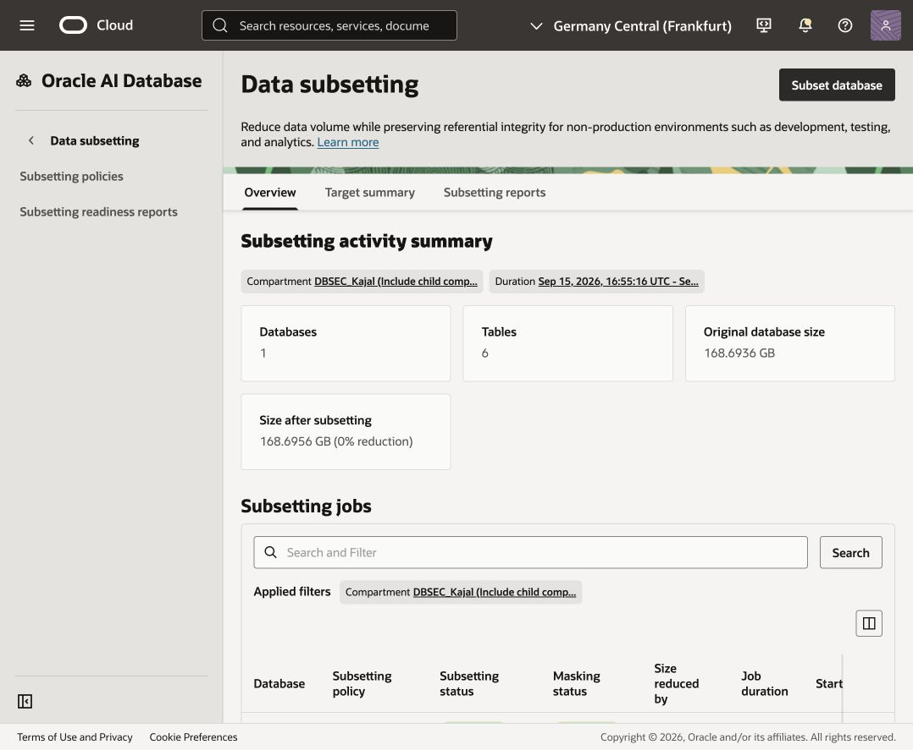
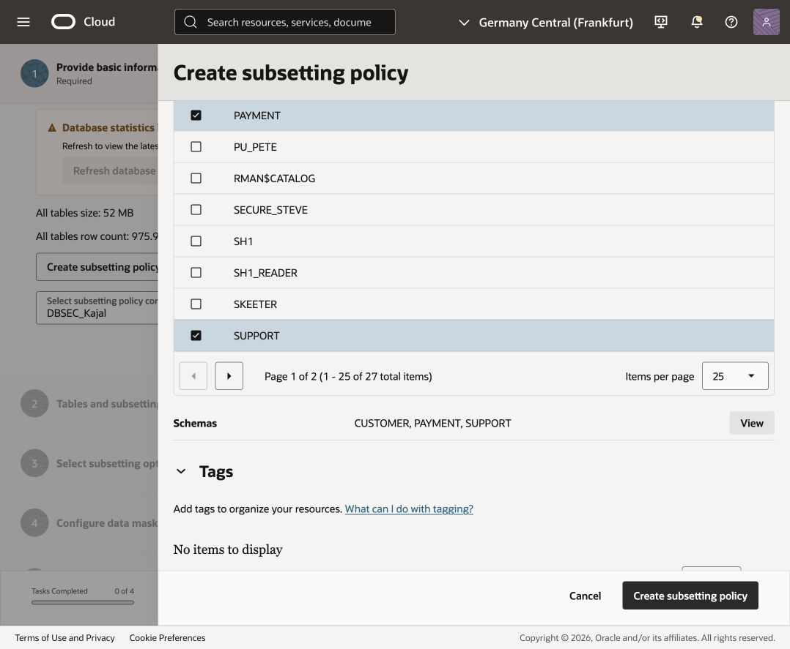
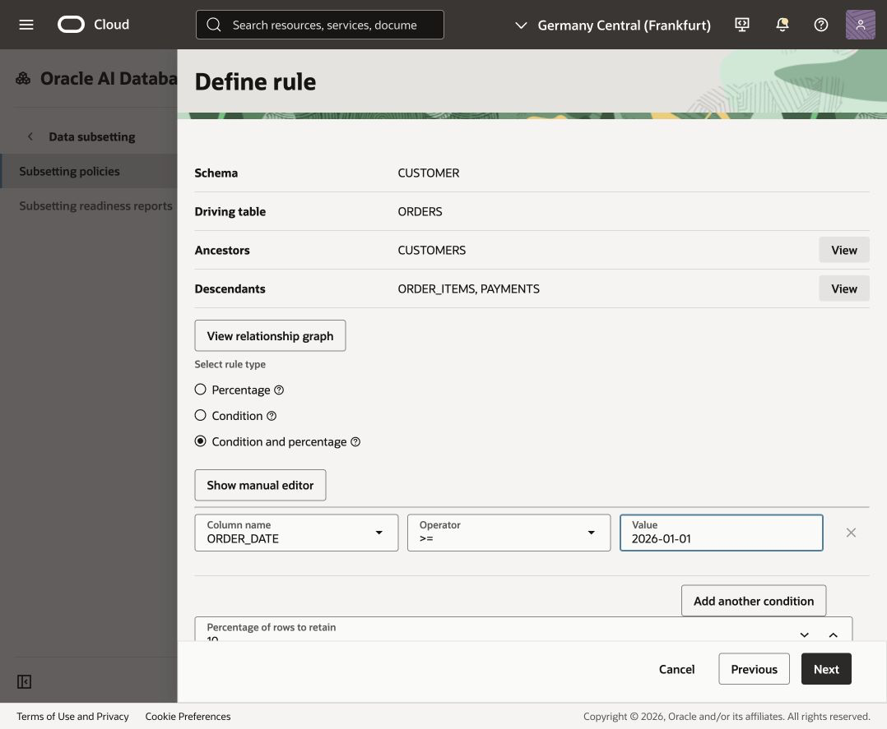
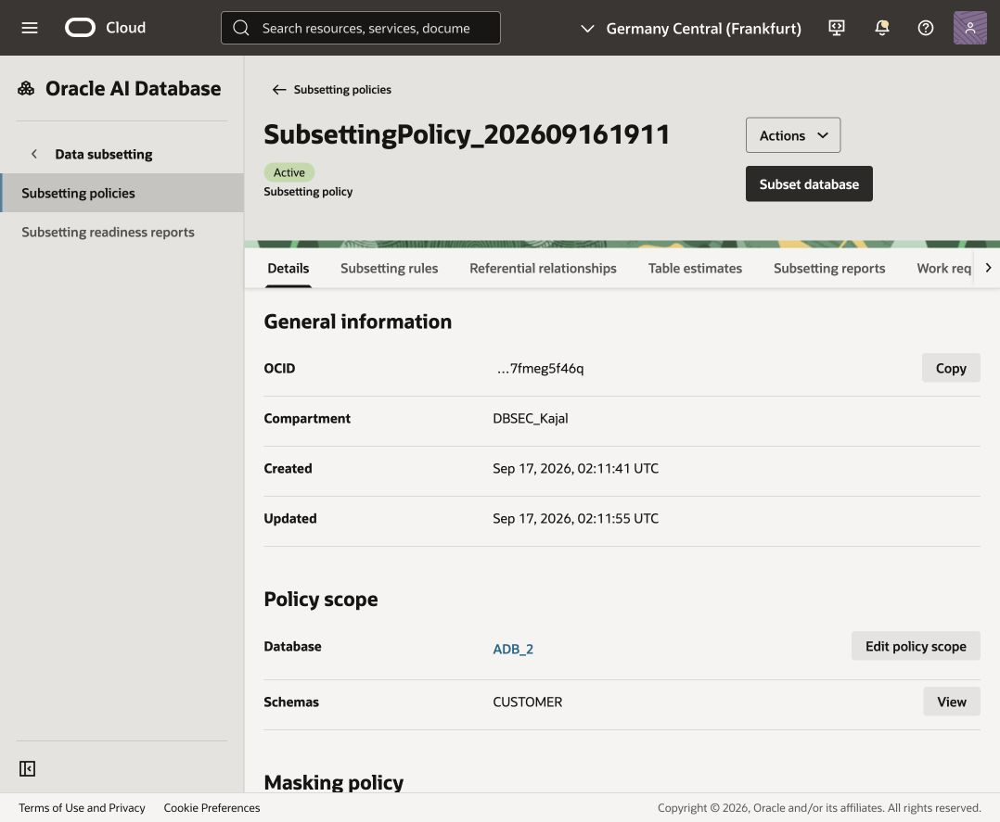

# Subset data

## Introduction

The application team needs a realistic test copy of the retail application data. Developers must be able to test customer profiles, orders, payments, and support tickets, but they should work with a smaller dataset that is isolated from the full source population. The copy must retain the relationships the application expects, including customers related to orders and the rows related to those orders.

In the previous labs, Data Discovery identified sensitive data across the `CUSTOMER`, `PAYMENT`, and `SUPPORT` schemas. The sensitive data model inventory was used to create a masking policy, and the pre-masking checks confirmed that the target database was ready. This lab continues that story by preparing a recent, smaller dataset for application testing.

Use the OCI Data Safe **Subset database** workflow to keep recent 2026 orders and then retain 10% of the rows that match the date condition. Related customer and order-item/payment rows remain aligned through the relationship settings.

Estimated Time: 20 minutes

### Objectives

- Open the Data Safe data subsetting overview and start the **Subset database** workflow.
- Create a subsetting policy that includes the `CUSTOMER`, `PAYMENT`, and `SUPPORT` schemas.
- Add a driving-table rule for `CUSTOMER.ORDERS`.
- In OCI's condition field, enter `ORDER_DATE >= '01-JAN-26'`, then retain 10% of the matching rows. This is the OCI UI representation of January 1, 2026; use the ANSI SQL form `DATE '2026-01-01'` in SQL Developer or Database Actions.
- Keep referenced ancestor rows and referencing descendant rows so referential integrity is preserved.
- Review the subsetting options and submit only when the configuration is correct.

### Prerequisites

- An Oracle Cloud account with access to Data Safe.
- The regastered target database used in the discovery and masking labs (`ADB_2` in the reference screenshots).
- The previous sensitive data model, masking policy, and pre-masking checks completed.
- Database credentials available for the target database when the workflow requests them.

### Scenario

Continue acting as the database security administrator. The application team needs a recent, smaller dataset for testing customer profiles, orders, payments, and support tickets. Masking has already been planned and pre-checked. Now subset the source while preserving the relationships needed by the application.

### Task 2: Create the Data Safe subsetting service account

Before opening the subsetting workflow, have a database administrator create a dedicated account for Data Safe on the target database. Data Safe uses this account to authenticate to the target, refresh statistics, estimate the reduction, and run the subsetting job. Using a separate account keeps the job credentials scoped to the subsetting operation instead of reusing a personal administrator account.

Connect to the target database as `ADMIN`, `SYS`, or another account that can create users and grant roles, then run the following. Replace `<strong-password>` with a password that meets your database password policy; store it securely because you will enter it in the Data Safe workflow.

```sql
CREATE USER DS_SUBSETTING IDENTIFIED BY "<strong-password>"
  DEFAULT TABLESPACE "DATA"
  TEMPORARY TABLESPACE "TEMP";

GRANT CREATE SESSION TO DS_SUBSETTING;
GRANT DS$DATA_SUBSETTING_ROLE TO DS_SUBSETTING;

ALTER USER DS_SUBSETTING ACCOUNT UNLOCK;
```

The `DS$DATA_SUBSETTING_ROLE` grant gives the account the database privileges required by Data Safe for data subsetting. Do not use a personal administrator account for the workflow. If the target database already provides a registered Data Safe service account, follow the target-registration guidance for that database instead of creating a duplicate account.

### Task 1: Capture baseline row counts

Before subsetting, connect to the source database in SQL Developer or Database Actions and record the starting row counts. These counts make it easy to confirm the effect of the subset operation later.

```sql
SELECT 'CUSTOMER.ORDERS' AS table_name, COUNT(*) AS rows_before FROM CUSTOMER.ORDERS
UNION ALL
SELECT 'CUSTOMER.CUSTOMERS', COUNT(*) FROM CUSTOMER.CUSTOMERS
UNION ALL
SELECT 'CUSTOMER.ORDER_ITEMS', COUNT(*) FROM CUSTOMER.ORDER_ITEMS
UNION ALL
SELECT 'PAYMENT.PAYMENTS', COUNT(*) FROM PAYMENT.PAYMENTS
UNION ALL
SELECT 'SUPPORT.SUPPORT_TICKETS', COUNT(*) FROM SUPPORT.SUPPORT_TICKETS;

SELECT COUNT(*) AS recent_orders_before
FROM CUSTOMER.ORDERS
WHERE ORDER_DATE >= DATE '2026-01-01';```

### Task 3: Create a new subsetting policy and open the workflow

1. Open **Data Safe** and select **Data subsetting**.
2. On the overview page, select **Subset database** in the upper-right corner.
3. In **Provide basic information**, select the database compartment and target database.
4. Enter the target database credentials when prompted. Data Safe uses them to refresh statistics, estimate reduction, and run the subset job.
5. In **Select subsetting policy compartment**, select the workshop compartment.
6. Select **Create subsetting policy** and configure the new policy as described in Task 4.



### Task 4: Create the subsetting policy scope

1. Set the policy compartment to the workshop compartment.
2. Give the policy a descriptive name such as `Subset_SDM1_2026`.
3. Add a description such as `Recent 2026 customer transaction data for application testing`.
4. Select **Get schemas from sensitive data model**.
5. In the sensitive data model compartment, select the model created in the Data Discovery lab, such as `SDM_mainLL` in the reference environment.
6. Confirm that the model brings in the `CUSTOMER`, `PAYMENT`, and `SUPPORT` schemas automatically. Do not manually select the schemas in this flow.
7. Select **Create subsetting policy** and wait for the policy to be available in the **Subset database** workflow.



### Task 5: Add subsetting rules

1. Expand **Tables and subsetting rules** and select **Add subsetting rule**.
2. Select `CUSTOMER.ORDERS` as the driving table.
3. Select **Condition and percentage**.
4. Configure the condition:
   - Column: `ORDER_DATE`
   - Operator: `>=`
   - Value: `01-JAN-26`
5. Set **Percentage of rows to retain** to `10`.
6. Keep **Keep only referenced rows** for ancestors so matching `CUSTOMER.CUSTOMERS` rows are retained.
7. Keep **Keep only referencing rows** for descendants so matching `CUSTOMER.ORDER_ITEMS` and `PAYMENT.PAYMENTS` rows remain consistent.
8. For other related tables, keep the default **Keep maximum rows** unless the test scenario requires a different policy.
9. Review the relationship graph before continuing.

The workflow applies the date condition first and the 10% retention second. It does not mean “10% of the full database”; it means 10% of the rows that satisfy `ORDER_DATE >= '01-JAN-26'`. In SQL, the equivalent date predicate is `ORDER_DATE >= DATE '2026-01-01'`.



### Task 6: Review subsetting options

1. In **Select subsetting options**, review unrelated-table processing, degree of parallelism, redo logging, recompilation, and statistics refresh.
2. Keep the defaults unless your target-database requirements call for a change.
3. Because masking was handled in the previous lab, leave **Data masking after subsetting** disabled for this lab unless you intentionally want to combine both operations.
4. Use the active policy details page as a reference for the options and policy state.



### Task 7: Review and submit

1. Open **Review and submit**.
2. Confirm the target database, policy name, selected schemas, driving table, rule condition, 10% retention, and relationship settings.
3. Confirm the estimated size reduction.
4. Submit the subsetting job only after the review is complete.
5. Monitor the work request and **Subsetting reports** until the job reaches a terminal status.
6. Verify that the subset contains the recent order population and the related rows required by the application test.

### Task 8: Review the subset and masked data

After the subsetting job completes, connect to the subset target in SQL Developer or Database Actions. Compare the results with the baseline counts from the beginning of the lab.

```sql
SELECT 'CUSTOMER.ORDERS' AS table_name, COUNT(*) AS rows_after FROM CUSTOMER.ORDERS
UNION ALL
SELECT 'CUSTOMER.CUSTOMERS', COUNT(*) FROM CUSTOMER.CUSTOMERS
UNION ALL
SELECT 'CUSTOMER.ORDER_ITEMS', COUNT(*) FROM CUSTOMER.ORDER_ITEMS
UNION ALL
SELECT 'PAYMENT.PAYMENTS', COUNT(*) FROM PAYMENT.PAYMENTS
UNION ALL
SELECT 'SUPPORT.SUPPORT_TICKETS', COUNT(*) FROM SUPPORT.SUPPORT_TICKETS;

SELECT ORDER_ID, CUSTOMER_ID, ORDER_DATE, ORDER_STATUS, ORDER_TOTAL
FROM CUSTOMER.ORDERS
WHERE ORDER_DATE >= DATE '2026-01-01'
FETCH FIRST 10 ROWS ONLY;
```

If masking was enabled in the subsetting workflow, or the preceding masking job was run on this copy, inspect representative sensitive columns and confirm that values are masked while the required formats remain usable:

```sql
SELECT CUSTOMER_ID, FIRST_NAME, LAST_NAME, EMAIL_ADDRESS, PHONE_NUMBER
FROM CUSTOMER.CUSTOMERS
FETCH FIRST 10 ROWS ONLY;

SELECT CARDHOLDER_NAME
FROM PAYMENT.PAYMENTS
FETCH FIRST 10 ROWS ONLY;

SELECT CONTACT_EMAIL, CONTACT_PHONE
FROM SUPPORT.SUPPORT_TICKETS
FETCH FIRST 10 ROWS ONLY;
```

Confirm that the order count is smaller than the source count, that the retained orders are from `2026-01-01` onward, and that the related rows needed by the application remain available. When masking is enabled, confirm that the sensitive values are no longer the original values.

### Validation checklist

| Item | Expected configuration |
| --- | --- |
| Target database | `ADB_2` or your registered target database |
| Schemas | `CUSTOMER`, `PAYMENT`, `SUPPORT` |
| Driving table | `CUSTOMER.ORDERS` |
| Condition | `ORDER_DATE >= '01-JAN-26'` in the OCI UI; `ORDER_DATE >= DATE '2026-01-01'` in SQL |
| Retention | 10% of condition-matching rows |
| Ancestors | Keep only referenced rows |
| Descendants | Keep only referencing rows |
| Masking | Disabled here; handled by the preceding masking lab |

### Learn More

- [Data Subsetting overview](https://docs.oracle.com/en/cloud/paas/data-safe/udscs/data-subsetting-overview.html)

### Acknowledgements

- Author - Jody Glover, Lead Principal User Assistance Developer, Database Development
- Contributor - Kajal Singh, Product Manager, Oracle Database Security
- Last Updated By/Date - Kajal Singh, September 21, 2026
